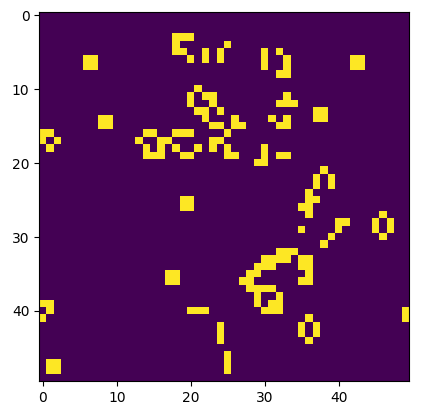
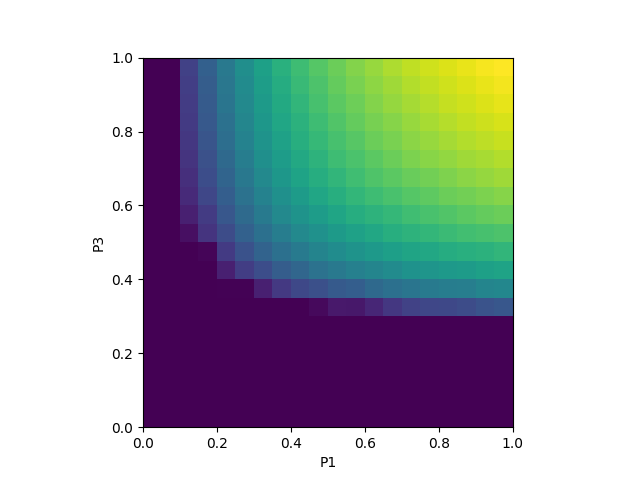

# Models of Conway's Game of Life, and an infection model.

## Game of life
This simulation follows the standard rules of the [game of life](https://en.wikipedia.org/wiki/Conway%27s_Game_of_Life), and can be started from a random initial condition, an oscillating one, or a "glider" through the use of command line arguments: `python game_of_life.py <R|O|G> <grid size>`.

A screenshot during a game of life simulation from random initial conditions. Several oscillators and unchanging objects such as "blocks" are visible. The dynamics of the system such as the time to equlibration and the velocity of a glider were studied.

## SIRS model
This simulation is a cellular automaton where each cell can be "susceptible", "infected", or "recovered". Recovered cells can become susceptible again with a certain probability. The probabilities of infection and recovering can also be varied. A visualisation can be shown using `python SIRS.py vis <grid size~50> <p1> <p2> <p3>` where the probabilites can be between 0 and 1.

A phase plot showing how the average number of infected cells changed with the probabilities of infection and recovery. It is clear that quick infection and recovery increased the prevalence of infected cells.